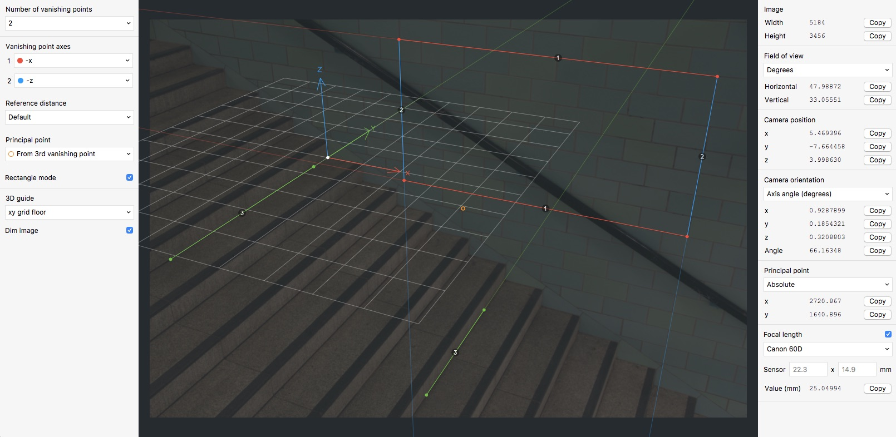

## What is this?

fSpy is an open source, cross platform app for still image camera matching. See [fspy.io](https://fspy.io) for more info. The source code is available under the GPL license.



## Backstory

Once upon a time I wrote BLAM, a [Blender](https://blender.org) add-on for still image camera calibration that, despite its clunky UI, has gained some popularity in the Blender community. fSpy is an attempt to bring BLAM's functionality to a wider audience in the form of a stand alone app.

## Using the computed camera parameters in other appliations

In theory, camera parameters computed by fSpy could be used in any application that has a notion of a 3D camera and provides some way of setting the camera parameters. If you're a Blender user, have a look at the [offical fSpy importer add-on](https://github.com/stuffmatic/fSpy-Blender). If you're using an application without a dedicated importer, you may still be able to manually copy the camera parameters from fSpy.

Interested in writing an importer for your favorite application? Then the [fSpy project file format spec](https://github.com/stuffmatic/fSpy/blob/develop/project_file_format.md) is a good starting point.


## Building and running

The following instructions are for developers. If you just want to run the app, [download the latest executable for your platform](https://github.com/stuffmatic/fSpy/releases).

fSpy is written in [Typescript](https://www.typescriptlang.org) using [Electron](https://electronjs.org), [React](https://reactjs.org) and [Redux](https://redux.js.org). [Visual Studio Code](https://code.visualstudio.com) is recommended for a pleasant editing experience.

To install necessary dependencies, run

```
yarn
```

The `src` folder contains two subfolders `main` and `gui`, containing code for the [Electron main and renderer processes](https://electronjs.org/docs/tutorial/application-architecture) respectively.

Here's how to run the app in development mode

1. Run `yarn dev-server` in a separate terminal tab to start the dev server
2. Run `yarn build-dev` to build both the main and GUI code. This build step is needed to generate main process code used to start up the app.
3. Run `yarn electron-dev` in a separate terminal tab to start an Electron instance which uses the dev server to provide automatic reloading on GUI code changes.

⚠️ The current build process is not ideal. For example, it lacks support for live reloading on main process code changes. Changes to main process code require a manual rebuild, i.e steps 2-3, in order to show up in the app.


## Creating binaries for distribution

To create executables for distribution, run

```
yarn dist
```

which invokes [Electron builder](https://github.com/electron-userland/electron-builder).